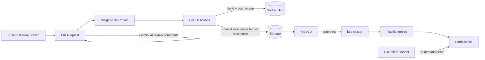

# DevOps Portfolio

A live portfolio site that doubles as a working **GitOps platform**. The site itself is a small React app, but the point of this repo is the infrastructure around it: containerized, deployed to Kubernetes through ArgoCD, with automated CI/CD, monitoring, and an AI-assisted review pipeline, all driven from Git.

> **Note on hosting:** the cluster runs locally on k3d, and live demos are served on-demand through a Cloudflare Tunnel. The infrastructure is real and reproducible; it simply isn't billed to an always-on cloud server. A public URL can be provided on request during a demo.

---

## Architecture



**The flow:** open a PR, the AI reviewer comments on it, merge it. GitHub Actions builds a Docker image, pushes it to Docker Hub, and commits the new image tag back into Git (via a Kustomize `images` override). ArgoCD notices the Git change and syncs the cluster. Traefik serves the result. Nothing is deployed by hand.

---

## Tech stack

| Layer | Tooling |
|-------|---------|
| Orchestration | Kubernetes (k3d) |
| GitOps | ArgoCD |
| Manifests | Kustomize |
| Containers | Docker, Docker Hub |
| CI/CD | GitHub Actions |
| Ingress | Traefik |
| Monitoring | Prometheus + Grafana (kube-prometheus-stack) |
| AI review | Gemini API |
| Frontend | React + Vite, served by nginx |
| Platform | WSL2 (Ubuntu) on Windows |

---

## Environments

Two environments running side by side, promoted through Git:

- **dev** (staging) , `dev` branch → `http://dev.localhost`
- **prod** (production) , `main` branch → `http://prod.localhost`

A branch guard ensures only `dev` can be merged into `main`, so production is always promoted from tested staging code.

---

## Highlights

- **GitOps end to end** , Git is the single source of truth; ArgoCD auto-syncs the cluster with no manual `kubectl apply`.
- **Two-environment promotion** , feature → dev → main, with an automated guard protecting `main`.
- **Kustomize-managed image tags** , the deploy manifest is static; the image tag lives in `kustomization.yaml`, which eliminated a recurring merge-conflict problem.
- **Declarative monitoring** , the full Prometheus + Grafana stack is deployed through ArgoCD from a single Application manifest.
- **AI PR reviewer** , a GitHub Action sends each PR diff to the Gemini API and posts an advisory review comment (non-blocking, with fork-safety).
- **Issue → board automation** , new issues are auto-added to a GitHub Projects board with a clean label taxonomy.
- **One-command bootstrap** , `scripts/bash/up.sh` starts Docker and the cluster, waits until pods are actually ready, and prints access URLs.
- **Scripts showcase** , the site renders real automation scripts from a single source-of-truth file.

---

## Repo layout

```
.github/workflows/   CI/CD, AI review, branch guard, project automation
frontend/            React + Vite app (Dockerfile + nginx serve it)
infrastructure/
  kubernetes/dev/    dev manifests (Kustomize base)
  kubernetes/prod/   prod manifests (Kustomize base)
  argocd/            ArgoCD Application manifests (dev, prod, monitoring)
scripts/             showcased automation scripts (bash, python)
RUNBOOK.md           how to run and operate the platform
```

---

## Running it locally

See [RUNBOOK.md](./RUNBOOK.md) for full setup and daily operation. The short version once set up:

```bash
./scripts/bash/up.sh
```

---

## Roadmap

- Terraform configuration as a validate-only IaC showcase (provisionable on demand)
- Trivy image scanning in CI
- Helm chart authoring for the app
- Optional always-on hosting
